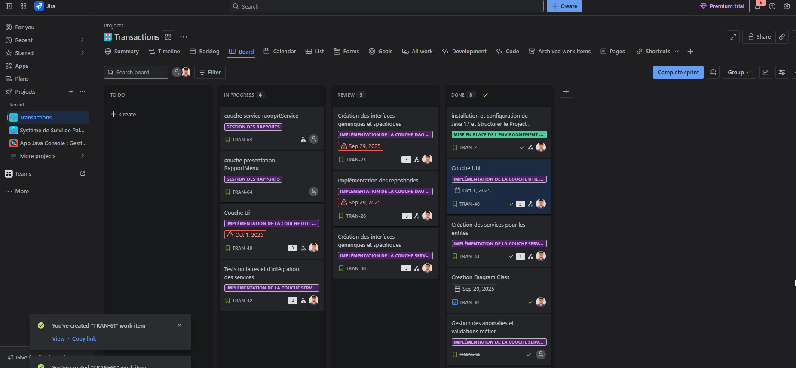
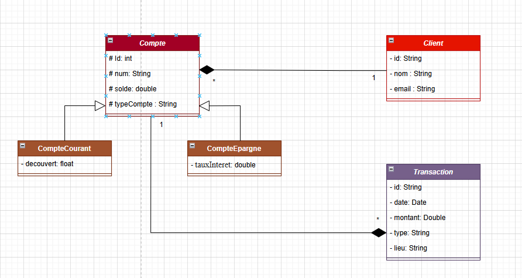
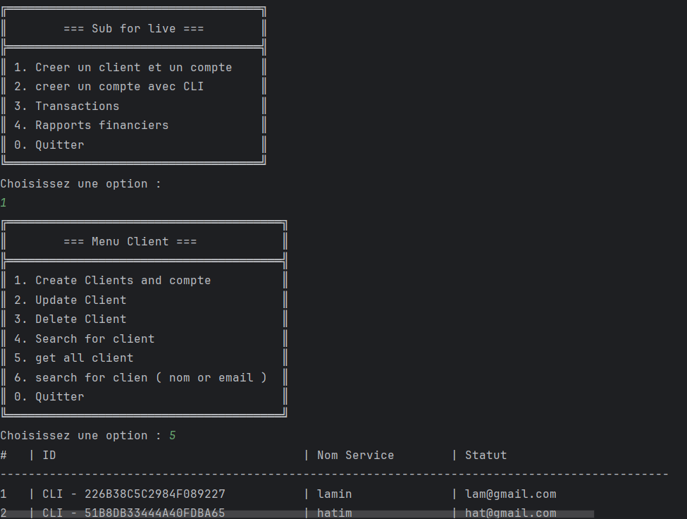

# 🏦 Transactions-Bancaires – Analyse et Détection des Anomalies

### Modernisez la gestion des flux bancaires avec une application Java 17 robuste, fonctionnelle et sécurisée.

---

## 🌟 Contexte du Projet

La gestion des transactions bancaires est un enjeu majeur pour les établissements financiers.  
Détecter les anomalies, centraliser les opérations, suivre l’activité des comptes et produire des rapports fiables sont essentiels pour les banques et leurs clients.

**Banque Al Baraka** souhaite, grâce à l’agence SoluBank Systems, développer une application interne pour :
- Centraliser clients, comptes et transactions,
- Détecter automatiquement anomalies et opérations suspectes,
- Identifier comptes inactifs ou comportements inhabituels,
- Générer des rapports exploitables pour la prise de décision.

---

## 🏛️ Structure de l’Application

- **Couche présentation (UI/Menu)** : interface textuelle interactive.
- **Couche métier (Services)** : logique pour gérer opérations, détection d’anomalies, statistiques, rapports financiers.
- **Couche Entity** : objets métiers persistants (`Client`, `Compte`, `Transaction`), records/sealed classes.
- **Couche DAO** : persistance JDBC vers MySQL ou PostgreSQL, CRUD, recherches.
- **Couche utilitaire** : gestion des dates, formatage, validation des entrées.

---

## 🛠️ Fonctionnalités

### Entités et DAO
- **Client (record)** : id, nom, email.
- **Compte (sealed class)** : id, numéro, solde, idClient.
    - **CompteCourant** : découvert autorisé.
    - **CompteEpargne** : taux d’intérêt.
- **Transaction (record)** : id, date, montant, type (VERSEMENT, RETRAIT, VIREMENT), lieu, idCompte.

### Services Métier
- **ClientService**
    - CRUD client, recherche, information pour rapports (solde total, nombre de comptes…)
- **CompteService**
    - Création/mise à jour des comptes, recherche par client/numéro, solde max/min.
- **TransactionService**
    - Historique et filtrage des transactions (par montant, type, date, lieu)
    - Regroupement par type/période, calculs (total, moyenne)
    - Détection des transactions suspectes (montant élevé, lieu inhabituel, fréquence anormale)
- **RapportService**
    - Top 5 clients par solde
    - Rapport mensuel (nombre/volume par type)
    - Détection des transactions suspectes
    - Comptes inactifs

### UI (Interface Utilisateur)
- Création de clients et comptes
- Enregistrement d’une transaction (versement, retrait, virement)
- Consultation historique de transactions
- Analyses : top clients, transactions par type/mois, comptes inactifs, transactions suspectes
- Alertes (solde bas, inactivité)

---

## 📊 Base de Données & Relations

- **Client** : id, nom, email
- **Compte** : id, numéro, solde, idClient, typeCompte, découvert autorisé / taux d’intérêt
- **Transaction** : id, date, montant, type, lieu, idCompte

Relations :
- Un client a plusieurs comptes
- Un compte a plusieurs transactions
- Intégrité référentielle (clés primaires/étrangères)

---

## 🚀 Technologies Utilisées

- **Java 17 (records, sealed, switch expressions, var)**
- **JDBC** (MySQL/PostgreSQL)
- **Stream API, Collectors, Optional, Lambda**
- **Architecture en couches**
- **Git** (commits réguliers)
- **Console interactive**

---

## 📂 Structure du Projet

```plaintext
📁 Transactions-Bancaires/
├── .gitignore
├── README.md
├── docs/
│   ├── diagramClass.png
│   ├── app_screenshot.png
│   └── jira_board.png
├── dao/
│   ├── ClientRepolmp.java
│   ├── ClientRepository.java
│   ├── CompteRepolmp.java
│   ├── CompteRepository.java
│   ├── Crud.java
│   ├── TransactionRepolmp.java
│   └── TransactionRepository.java
├── dataBase/
│   ├── ConectionDB.java
│   └── data.sql
├── entity/
│   ├── Client.java
│   ├── Compte.java
│   ├── CompteCourant.java
│   ├── CompteEpargne.java
│   └── Transaction.java
├── enums/
│   ├── typeCompte.java
│   └── typeTransaction.java
├── service/
│   ├── ClientService.java
│   ├── ClientServiceInterface.java
│   ├── CompteService.java
│   ├── CompteServiceInterface.java
│   └── RapportService.java
│   ├── util/
│   │   ├── DateUtil.java
│   │   ├── Helper.java
│   │   └── Validateur.java
│   └── ui/
│       ├── Menu.java
│       ├── ClientMenu.java
│       ├── CompteMenu.java
│       ├── TransactionMenu.java
│       └── RapportMenu.java
├── Main.java

---

## 📝 Guide d’Installation

Cloner le dépôt :
```bash
git clone https://github.com/Mahjoubech/Transactions-Bancaires.git
cd Transactions-Bancaires
```

Configurer la base de données (MySQL ou PostgreSQL) :  
Créer les tables `Client`, `Compte`, `Transaction` avec clés et contraintes.

Compiler et exécuter :
```bash
javac src/**/*.java
java -cp src Main
```
*Ou créez un JAR selon votre IDE.*

---

## 🎯 Objectifs et Exigences

- **Java 17** (records, sealed, switch expressions, var)
- **Programmation fonctionnelle** (Stream, Collectors, Optional, lambda)
- **Persistance JDBC** (MySQL/PostgreSQL)
- **Architecture MVC en couches**
- **Gestion des exceptions soignée**
- **Git** (commits réguliers, messages clairs)
- **Livrables** : code source, README, diagramme de classe, JAR exécutable, screenshots

---

## 📸 Screenshots & Diagrammes

### 📋 Gestion de projet (JIRA/Issues)
*Ajoutez ici une capture d’écran de votre gestion de tâches !*  


### 🗂️ Diagramme UML des Classes
*Ajoutez ici votre diagramme UML !*  


### 🖥️ Aperçu Application (console)
*Ajoutez ici des captures d’écran de l’application !*  


---

## 📊 Critères d’Évaluation

- **Structure du code / architecture**
- **Fonctionnalités conformes au cahier des charges**
- **Qualité de l’interface et de l’expérience utilisateur**
- **Documentation claire et complète**
- **Livrables conformes et bien organisés**
- **Diagramme UML fidèle au code**

---

## 📬 Contact

Pour toute question, ouvrez une issue sur [GitHub](https://github.com/Mahjoubech/Transactions-Bancaires/issues).

---

## ⚖️ Licence

MIT